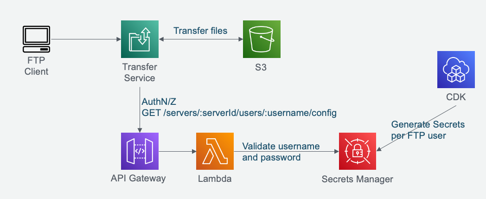
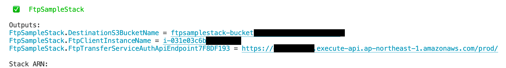

# Transfer Family FTP server with password authentication CDK sample
[](https://github.com/aws-samples/ftp-with-password-authentication-cdk-sample/actions/workflows/build.yml)

This sample shows how to define Transfer Family FTP/SFTP server with password authentication by AWS CDK. 

It includes CDK constructs that follows the below architecture, and a CDK stack to show how to use the constructs.



You can read this article for futher detail of the architecture: [Enable password authentication for AWS Transfer Family using AWS Secrets Manager (updated)](https://aws.amazon.com/blogs/storage/enable-password-authentication-for-aws-transfer-family-using-aws-secrets-manager-updated/)

## Code sample
In this sample, you can define FTP server with password authentication by the following code:

```ts

// an AWS Transfer SFTP server
const ftp = new PasswordAuthenticatedFtp(this, `Ftp`, {
    vpc,
    protocol: "SFTP",
});

// Create an FTP user with randomly generated password
new FtpUser(this, `User1`, {
    transferServerId: ftp.server.attrServerId,
    accessibleBucket: bucket,
    homeDirectory: "home",
});

// You can also specify password explicitly
new FtpUser(this, `User2`, {
    transferServerId: ftp.server.attrServerId,
    accessibleBucket: bucket,
    homeDirectory: "home",
    password: "passw0rd",
});
```

The actual constructs are located in [`lib/ftp`  directory](./lib/ftp).
You can copy these files into your project and freely modify them as your own requirements.

## Deploy
Before deploying this sample, you must install AWS Cloud Development Kit prerequisites. [Please refer to this document](https://docs.aws.amazon.com/cdk/latest/guide/getting_started.html) for the detailed instruction. Please make sure you've successfully completed `cdk bootstrap` step.

After that, clone this repository and go to the root directory.

You must first install Node.js dependencies for CDK code by the following commands:

```sh
npm ci
```

Now you can deploy this sample stack (`FtpSampleStack`) by the following command:

```sh
npx cdk deploy --require-approval never
```

Initial deployment usually takes about 10 minutes.

After a successful deployment, you can check the name of the S3 bucket and EC2 instance id for the testing purpose in the stack output.



## Usage
After the deployment, let's check if the sample is successfuly deployed by actually connecting to your SFTP server.

First check the IP address of your SFTP server. You can find it in [AWS Transfer Family Management console](https://console.aws.amazon.com/transfer/home).

Then connect to the EC2 instance via SSM Session Manager. It will work as a SFTP client for testing. To connect your EC2 instancne, please check the following document: [Connect to your Linux instance using Session Manager](https://docs.aws.amazon.com/AWSEC2/latest/UserGuide/session-manager.html).

In the EC2 ssh session, to connect your SFTP server, run the command below and enter the password.

```sh
sftp [username]@[IP address of your SFTP server]
```

For this sample, you can use the below login credentials.

|username|password|
|--|--|
|user1|Randomly generated; see [Secrets Manager console](https://console.aws.amazon.com/secretsmanager/home#!/listSecrets) for its value|
|user2|password|

Now you should be able to successfully login to the SFTP server. Let's test some SFTP commands to transfer files.

You can find the actual transferred files in the S3 bucket. Check it in [S3 management console](https://s3.console.aws.amazon.com/s3/home).

## Clean up
To avoid incurring future charges, clean up the resources you created.

You can remove all the AWS resources deployed by this sample running the following command:

```sh
npx cdk destroy --force
```

## Security
See [CONTRIBUTING](CONTRIBUTING.md#security-issue-notifications) for more information.

## License
This library is licensed under the MIT-0 License. See the LICENSE file.
